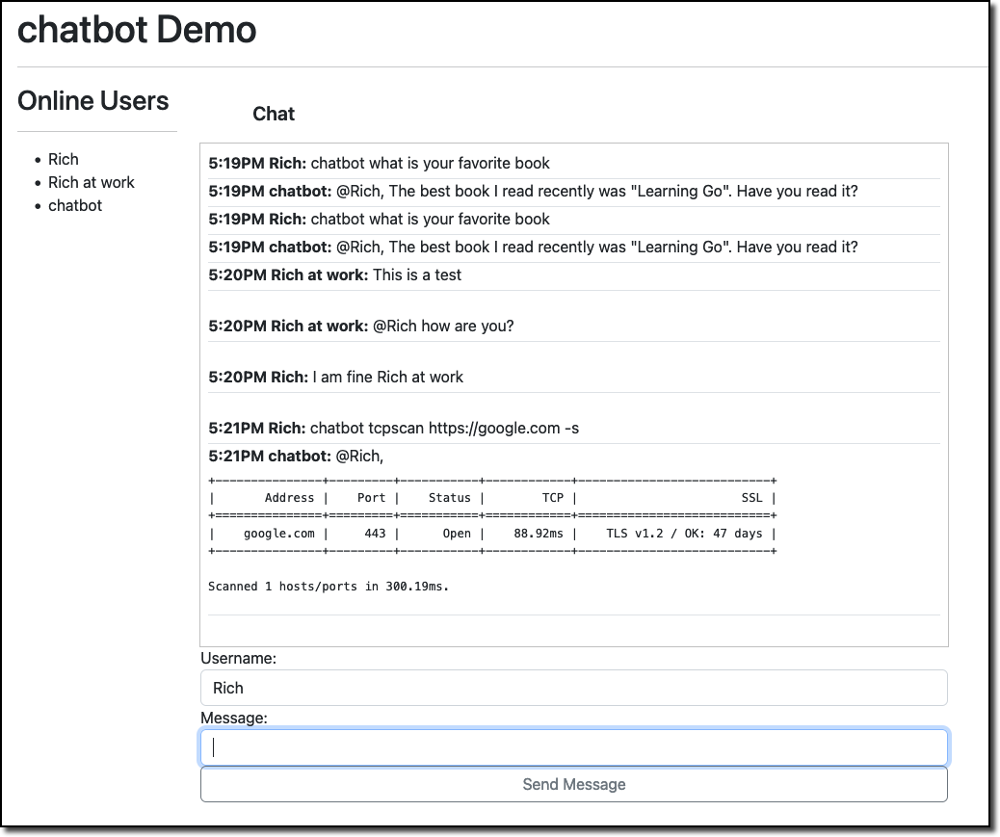
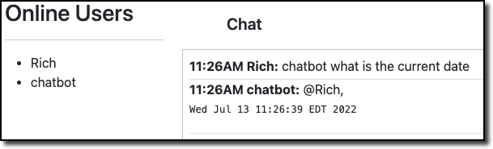

# Chatbot Demo

This is a small program, written mainly with help from a Udemy class I am taking that shows how to use websockets. Fantastic course by Trevor Sawler:

[Working with WebSockets in Go (Golang) | Udemy](https://www.udemy.com/course/working-with-websockets-in-go/)

You should be able to clone this directory and run it. 

```bash
go run *.go -b cloudgenie -h 10.1.1.130 -p 8888 -r rive
```

When Started the console looks like this:

```bash
chatbot]$  go run *.go -b cloudgenie -h 10.1.1.130 -p 8888 -r rive
2022/07/12 17:43:39 Starting channel listener
2022/07/12 17:43:39 Starting Web Server On Port 8080
2022/07/12 17:43:39 rivescript initialized

```

This needs a lot of work, especially in the Javascript area. I am bad enough at Go, I have to look up how to spell Javascript.

When running you can ask the 'chatbot' questions. You'll need my tcpscan https://github.com/rmasci/tcpscan if you want to run the rivescript that executes a LocalCommand.



## LocalCommand

In this version, if the first word of the rivescript response is LocalCommand that tells the chatbot it needs to exec the rest of the statement.   For example if you wanted to show the current date:

```rivescript
+ what is the current date
- LocalCommand date
```

When typed to the chatbot it looks like this:


